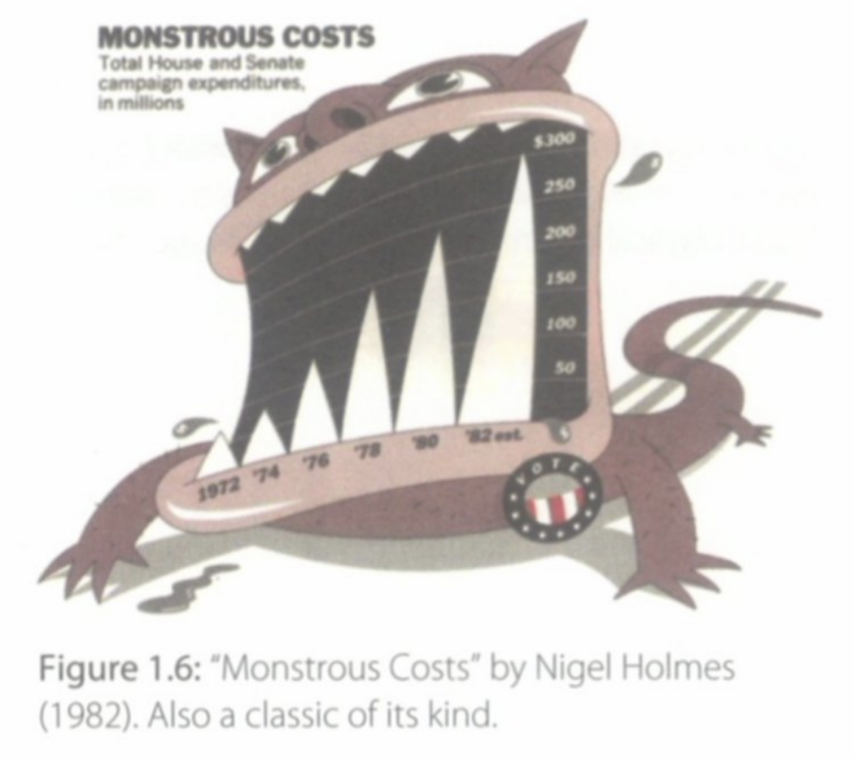

```{r setup, include=FALSE}
knitr::opts_chunk$set(echo = TRUE)
library(knitr)
library(gapminder)
library(ggplot2)
library(plotly)
```

# Question 1: RMarkdown basics

**Part 1.1**

## Anscombe's Quartet of 'Identical' Simple Linear Regressions

### Description

Four $x-y$ datasets which have the same traditional statistical properties (mean, variance, correlation, regression line, etc.), yet are quite different.

### Usage

``` {r, eval=FALSE}
anscombe
```

### Format

A data frame with 11 observations on 8 variables.

-   `x1 == x2 == x3` the integers 4:14, specially arranged
-   `x4` values 8 and 19
-   `y1, y2, y3, y4` numbers in (3, 12.5) with mean 7.5 and standard deviation 2.03

### Source

Tufte, Edward R. (1989). *The Visual Display of Quantitative Information*, 13–14. Graphics Press.

### References

Anscombe, Francis J. (1973). Graphs in statistical analysis. *The American Statistician*, **27**, 17–21. [doi:10.2307/2682899](https://doi.org/10.2307/2682899)]

### Examples

```{r, echo=FALSE}
require(stats); require(graphics)
kable(summary(anscombe))
```

The `summary` function above gives the summary statistics for each of the columns (`x1, x2, x3, x4, y1, y2, y3, y4`) in the `anscombe` dataset.

```{r, echo=FALSE}
##-- now some "magic" to do the 4 regressions in a loop:
ff <- y ~ x
mods <- setNames(as.list(1:4), paste0("lm", 1:4))

for(i in 1:4) {
  ff[2:3] <- lapply(paste0(c("y","x"), i), as.name)
  ## or   ff[[2]] <- as.name(paste0("y", i))
  ##      ff[[3]] <- as.name(paste0("x", i))
  mods[[i]] <- lmi <- lm(ff, data = anscombe)
  #print(anova(lmi))
}
#print output of linear models with kable
kable(anova(mods[[1]]))
kable(anova(mods[[2]]))
kable(anova(mods[[3]]))
kable(anova(mods[[4]]))

```

Above, we see the ANOVA table for the output of each of the four linear regression models created in the for-loop, each one regressing `y` on `x` using the 11 observations in each of the four "datasets". After running the for-loop to run a simple linear regression model on each of the datasets, we then print the analysis of variance table using the `kable()` function, which cannot be run in a for-loop, and we see that the ANOVA tables for each model are extremely similar.


```{r, echo=FALSE}
## See how close they are (numerically!)
kable(sapply(mods, coef))
kable(lapply(mods, function(fm) coef(summary(fm))))
```

The numerical properties of the simple linear regression model for each of the four datasets are extremely similar: the intercepts, slope, standard errors, t-statistics and p-values are all almost identical.

```{r, echo=FALSE}
## Now, do what you should have done in the first place: PLOTS
op <- par(mfrow = c(2, 2), mar = 0.1+c(4,4,1,1), oma =  c(0, 0, 2, 0))
for(i in 1:4) {
  ff[2:3] <- lapply(paste0(c("y","x"), i), as.name)
  plot(ff, data = anscombe, col = "red", pch = 21, bg = "orange", cex = 1.2,
       xlim = c(3, 19), ylim = c(3, 13))
  abline(mods[[i]], col = "blue")
}
mtext("Anscombe's 4 Regression data sets", outer = TRUE, cex = 1.5)
par(op)
```
The plots above tell a very different story than the ANOVA tables and the numerical properties of the linear regression modes. Using these visualizations, we see that the trends, distributions, and shapes of the data are far from identical: in fact, they are each very distinct from one another and significantly different conclusions should be drawn from each dataset. If one had not visualized this data and simply relied on the numerical properties as we generated first, deeply incorrect assumptions might have been made.

In `x1`, we see a set of data that looks to be a decent fit for the linear model. `x2` tells a different story: we see a quadratic trend rather than a linear one. In `x3`, the data does appear to be linear, in fact with significantly less variance than in `x1`-but a single positive outlier distorts the slope of the model. Finally, `x4` appears to represent categorical data, again with a single outlier.

**Part 1.2**

```{r, out.width='40%', fig.align='center', fig.cap="\'Monstrous Costs\' by Nigel Holmes (1982)", echo=FALSE}
      
   
```

# Question 2: Analyze the `gapminder` interactive plot from the introduction.

**Part 2.1**

```{r, echo=FALSE, warning=FALSE}
gg <- 
  ggplot(gapminder, aes(gdpPercap, lifeExp, color = continent)) +
    geom_point(aes(size = pop, frame = year, ids = country)) +
    scale_x_log10() + 
    theme(legend.title = element_blank())

ggplotly(gg)
```
**Part 2.2**

From the year 1957, I identified the red marker that lies at roughly 40 on the `lifeExp` axis, at the center between "1e+03" and "1e+04" on the `gdpPercap` axis. From the perspective of "preattentive pop-out", I think this particular marker caught my attention for two reasons: the color of the marker and its position on the plot relative to the other markers. To me, the red color strikes a stronger contrast against the grey background of the plot than the other colors do, and it also presents a strong contrast against the rest of the other colors themselves. Additionally, whereas many of the markers are moderately or tightly clustered together, this marker separates itself from many of the others by visual distance, and not only does it not lie a tight cluster, but it is positioned along the outside of the general grouping of markers. As the mind likes to place structure on objects based on their proximity to each other, this "outlier" nature makes it stand out on a quick visual scan.

I identified the country as Angola. I was not surprised to find that it had one of the lowest life expectancies, but I did find it surprising and interesting to learn that it has such a low life expectancy given that it seems to fall roughly around the 60th percentile in terms of GDP per capita of all of the countries. Far from affirming an intuition, I found this pairing of information (relatively high GDP per capita but one of the lowest life expectancies) to be unexpected and interesting to consider about why that might be so.

Upon playing the animated sequence, the marker that immediately caught my attention was the left-most large green marker that I later identified as belonging to China. This marker caught my attention on a pre-attention level due to its size. It is one of two markers that are significantly larger than any others, and even larger still than the next largest, and size of an object is known to be a factor in pre-attentive search. As the animation begins, it also displays an eye-catching vertical bouncing motion that further drew my attention. I was unsurprised to find out that the marker represented China, since I knew that marker size was correlated to population size. In general, the animation accorded with my expectations and what I know about the country, however, I did learn something interesting from the way the marker had a steep and significant single vertical drop in life expectancy around the year 1960 before continuing a slow and steady increase in both GDP per capita and life expectancy. This spurred me to research the history of China around the time, and I found out that this time marked the end of the period known as the Great Leap Forward, in which Chairman Mao Zedong led a campaign to transform China from an agragrian society to an industralized one, which led to a massive famine and the deaths of tens of millions of people.

**Part 2.3**


```{r, out.width='50%', fig.align='center', fig.show='hold', fig.cap="Plots of China and India in 1952 demonstrate the gestalt rule of similarity: things that look alike seem to be related. China and India are both represented by markers that are similarly very large, both significantly larger than any other marker, and therefore seem to be related.", echo=FALSE}
     knitr::include_graphics(c('HW1_figures/china.png', 'HW1_figures/india.png'))
   
```

```{r, out.width='50%', fig.align='center', fig.show='hold', fig.cap="Plots of Equatorial Guinea and Botswana in 2007 demonstrate the rule of proximity: things that are spatially near to one another seem to be related. These two countries are located extremely closely together on the plot, and therefore appear to be related to each other in terms of GDP per capita and life expectancy.", echo=FALSE}
     knitr::include_graphics(c('HW1_figures/equatorial_guinea.png', 'HW1_figures/botswana.png'))
   
```

```{r, out.width='50%', fig.align='center', fig.show='hold', fig.cap="Plots of Ireland and the United States in 2007 demonstrating the rule of figure and ground: visual elements are taken to be either in the foreground or in the background. Here, it appears that Ireland is in the foreground, that it is somehow 'on top' on the United States, which appears to be 'behind' it. In the context of this particular plot, this effect holds no statistical meaning.", echo=FALSE}
     knitr::include_graphics(c('HW1_figures/ireland.png', 'HW1_figures/united_states.png'))
   
```

```{r, out.width='50%', fig.align='center', fig.show='hold', fig.cap="Plots of all countries in 1952 and in 2007 demonstrate the concept of common fate: we see that most of the markers have moved in a positive direction along both axes, therefore much of the cloud moves in a 'southwest' to 'northeast' direction across the plot. The rule of common fate says that elements sharing a direction of movement are perceived as a unit. Here, this rule has the effect of suggesting that all countries are moving in a similar direction and following a similar trend of progress as a general unit, when this may not be the case.", echo=FALSE}
     knitr::include_graphics(c('HW1_figures/1952.png', 'HW1_figures/2007.png'))
```


**Part 2.4**

One inequality that is apparent when watching the animated plot is that some countries make significant gains to their GDP per capital and/or life expectancy, while other countries move very little in either or both of the directions. One way to highlight this inequality in growth (along the axis for both variables) would be to add a feature to the final static plot for the year 2007 that quantifies how much each country changed from the year 1952 to 2007 for both variables. This statistic could be added to the tooltip feature that already exists for each country, or perhaps be added on separately with a method to color code countries by amount of progress made: high levels of change, medium amounts of change, and little/no change - with potentially an additional indicator for countries that may have moved in the negative direction. This could be a helpful method to visualize and identify this kind of "inequality of progress", since it is difficult to observe and track this oneself while studying the animation, and certainly on a large scale, if we want to identify any patterns in which countries made the most and least amounts of gains in GDP per capital and life expectancy. Particularly if we created more than three levels of progress to indicate with color, such as 10 or 20 bins - or even a continuous color gradient rather than discrete chunks - it would begin to give us a general sense of what the distribution of progress statistics might look like.


